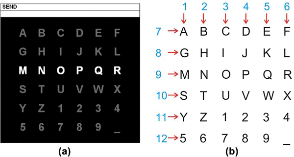

# 🧠 What is BCI?

💡 A **Brain-Computer Interface (BCI)** is a technology that allows the brain to communicate directly with a computer or external device.  
*It serves as a tool for non-muscular communication.*

---

### How It Works:  
- **Detection**: Captures brain signals, such as thoughts or intentions.  
- **Translation**: Converts these signals into commands for tasks.

---

# 🧠 What is P300 Speller?

💡 The **P300 Speller** is a BCI application designed for people who require a communication tool that uses brain activity alone.  
- Developed by **Farwell and Donchin** in **1988**

---

### EP VS ERP:
Evoked Potentials (EPs) and Event-Related Potentials (ERPs) are brain responses with distinct characteristics and applications.

| **Aspect**            | **Evoked Potentials (EPs)**                   | **Event-Related Potentials (ERPs)**              |
|------------------------|-----------------------------------------------|-------------------------------------------------|
| **Definition**         | Automatic brain responses to sensory stimuli | Task-driven brain responses to cognitive events |
| **Focus**              | Sensory processing                           | Higher-level cognitive processes (decision-making, attention, etc.) |
| **Timing**             | Early responses (10-100 ms)                  | Later responses (~100-600 ms)                   |

---

### P300:
**P300** is a specific brain activity and a type of **ERP**. It is linked to the brain's recognition of something **unexpected or rare**, showing a **positive deflection** in the EEG approximately **300 milliseconds** after detecting an infrequent target stimulus.

---

### P300 Speller:

The **P300 Speller** uses a **6x6 matrix** of characters, where the user focuses on a target character. The matrix rows and columns are randomly intensified at **5.7Hz**, with two out of 12 intensifications containing the target character. The brain generates a distinct **P300 response** to these infrequent stimuli, which is different from the responses to non-target stimuli. This **P300 wave** is used to identify the character the user is focusing on, enabling communication through brain activity.

---

# Dataset

- Download the dataset from:  
  [BCI Competition III - Dataset II](https://www.bbci.de/competition/download/competition_iii/albany/BCI_Comp_III_Wads_2004.zip)

---

### Data Collection:
- **Subjects**: Two participants, five sessions each.
- **Task**: Focus on one out of 36 different characters displayed on the screen.
- **Matrix Display**:  
  - 2.5 seconds of blank matrix, followed by random intensifications of rows and columns (100ms each with a 75ms blank period after).  
  - Repeated 15 times per character (180 total intensifications per epoch).
- **Data**:  
  - Bandpass filtered (0.1-60Hz) and digitized at **240Hz** (sampled 240 times per second).  
  - Recorded using **64 EEG channels**.  
  - 4 Matlab *.mat files: one training (85 characters) and one test (100 characters) for each of the two subjects, A and B.
